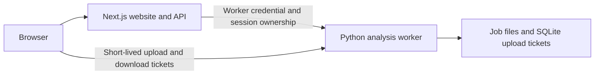

# Hosted FretFlow worker

The public pilot uses a Next.js frontend and a separate Python model worker. This guide describes the source configuration; it is not a capacity guarantee for 500 users. Deployment credentials, account details, runtime media and private verification captures are not included.

## Data flow

The web server signs an HttpOnly browser-session cookie. Hosted worker requests verify ownership before reading, editing or downloading a job. Upload tickets are single-use and expire after five minutes; download tickets are scoped to a file path and permit Range requests during their validity.

This is browser-session isolation, not account login. Clearing cookies or changing devices/domains creates a new session. There are no daily analysis quotas for individual sessions or the whole service.

## Configuration

Copy `.env.example` for the frontend and `ops/vps/worker.env.example` for the worker. Configure real values privately in each service's environment; the Next.js env file is not automatically loaded by Python.

- Set `FRETFLOW_HOSTED=1` on both services.
- Set the same random `FRETFLOW_WORKER_TOKEN` (at least 32 characters) on both services.
- Set `FRETFLOW_WORKER_URL` on the web server and `FRETFLOW_ALLOWED_ORIGINS` on the worker.
- Keep model execution in one worker process. Expose it through an authenticated HTTPS setup, keeping the raw local listener private.
- The production frontend intentionally has no fallback worker URL.

Large uploads and audio downloads go directly to the worker with short-lived authorization; they do not transit the Vercel function body. Secrets remain server-side. Do not log capability URLs or include them in public issues.

## Pilot limits

| Setting | Default pilot configuration |
| --- | --- |
| Executing analysis tasks | 1 |
| Active tasks, running plus queued | 3 |
| Active tasks per browser session | 1 |
| Clip duration | 180 seconds |
| Upload size | 95 MiB |
| Media/results retention | 24 hours from job creation; active jobs are not removed mid-analysis |

There is no daily usage counter. Legacy `FRETFLOW_DAILY_TOTAL` and `FRETFLOW_DAILY_PER_USER` settings and existing admission records are ignored. Upload ticket replay protection persists in SQLite. Queue backpressure, upload size and clip duration still apply; check `backend/app.py` and the environment examples. Job files store ownership for restart recovery. These mechanisms do not implement distributed leases or multi-machine scheduling.

## Run and recover

For local development, see [media setup](MEDIA-TRANSCRIPTION.md). `scripts/setup-cloud.sh` prepares a CPU-only Linux environment; `scripts/run-cloud.sh` loads a private `.runtime/hosted.env`, uses a supervisor lock and retries a failed child worker. It does not make the hosting machine itself persistent.

The pilot currently uses a temporary tunnel. Its address can change after restart and it provides no production availability guarantee. Stable hosting templates are in [ops/vps](../ops/vps/README.md); they must be installed and verified on an actual server before claiming restart recovery. Keep the previous deployment available when changing worker addresses.

For broader use, validate real peak memory, latency, queue behavior, backup retention and failure recovery on the intended host. Add account authentication and a stable backend endpoint as required. Local unit tests and a synthetic example do not prove real-music accuracy or production capacity.

## Verify

After model/environment setup, run `npm run test:audio`. Hosted tests cover session ownership, repeated analysis beyond the former daily limits, scoped tickets, replay rejection and persistence. Check the complete browser upload → analyze → play → download flow, including an upload above the frontend provider's request-body limit, a second session that cannot access the first session's job, and repeated uploads, demos and reanalysis from a session with exhausted legacy admission records.

Current frontend release checks are summarized in [maintenance notes](MAINTENANCE-2026-09-15.md). Raw verification artifacts stay private because they may contain recordings or authorization data.
